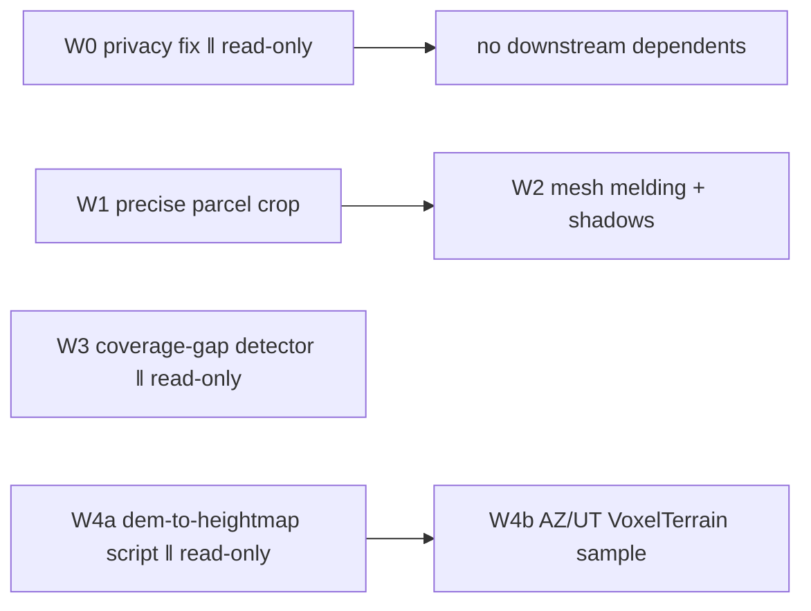

# Design discussion — mesh-quality-and-terrain-pipeline

## §0 Prelude

Same process note as `tools-skill-layer`: planned directly (verified file
reads, no vendored `hive/` runtime, no separate researcher/TPM dispatch) —
proportionate to infra/tooling work, not a UI-heavy multi-lens decision.

## §1 Goal

Close the real, concrete gaps the operator found while reviewing the v2
Prado reconstruction: a neighbor's structure still visible in the mesh, a
photogrammetry mesh with unfilled holes and flat lighting, no way to know
*where* those holes are on the ground, and no formalized path from a real
DEM (LiDAR) to a `VoxelTerrain` sample for land-only properties (the
AZ/UT "top end" flagship case). Explicitly NOT the CAD/DWG structure work
or headless beauty renders — both genuinely blocked on tool installs and
explicitly sequenced *after* this by the operator.

## §2 Proposed approach — four workstreams, one shared foundation

**W0 — privacy fix.** Strip the owner-name string from `parcel.geojson`'s
public properties. Small, immediate, unblocks nothing else but shouldn't
wait.

**W1 — precise parcel crop.** Re-run `crop-mesh.py` (already built, already
supports lat/lon bounds) against the REAL `parcel.geojson` polygon's own
extent instead of the manually-eyeballed box used this session, producing a
tighter `model.glb` that excludes the neighbor's structure. Re-run
`build-manifest.py` to regenerate the manifest. This is the foundation the
mesh-melding and shadow work builds on — do it first.

**W2 — mesh quality (melding + shadows).** Two separable pieces sharing one
file (`components/Model3D/Model3D.tsx`), sequenced not parallel to avoid
merge conflicts on the same component: (a) drape the existing
DSM-hillshade-derived terrain surface as a base layer beneath the mesh so
holes show terrain instead of blank white, (b) add real shadow-mapped
lighting (`<Canvas shadows>` + `castShadow`/`receiveShadow` + a
shadow-casting directional light).

**W3 — coverage-gap detection.** A new, standalone analysis script:
projects the mesh's real geometry to a 2D top-down coverage mask, finds
unfilled regions via connected-component analysis, reprojects each gap's
centroid back to real lat/lon (reusing the same UTM-offset technique
`crop-mesh.py` already established), and emits a simple report (GeoJSON +
a human-readable direction/location summary) — independent of W1/W2,
parallel-eligible.

**W4 — LiDAR terrain pipeline, AZ/UT flagship.** Formalize
`pipeline/scripts/dem-to-heightmap.py` (GeoTIFF DEM → `VoxelTerrain`-ready
`heightmap.json`) as a real, reusable, tested script — this session's own
external work already proved the ~15-line rasterio approach end-to-end
against a real 3DEP AZ tile, just never committed it. Then fetch a real
USGS 3DEP tile for an AZ (or UT) location and wire it as `VoxelTerrain`'s
new flagship land-only sample, demonstrating the Tier-1 "no structure
needed, the terrain drama is the pitch" case from the operator's own spec.
Independent of W1-W3, parallel-eligible.

## §3 Risks

| Risk | Severity | Mitigation |
|---|---|---|
| Re-cropping the mesh to the real parcel polygon accidentally clips real structure that's ON the boundary (roof overhang, etc.) | medium | Buffer the parcel bounds outward slightly (a few meters) rather than cropping to the exact legal line — the goal is "neighbor's house gone," not "shave the eaves off." |
| Terrain-draping under the mesh introduces a visible seam/z-fighting where mesh and terrain overlap | medium | Render the terrain surface slightly below the mesh's own lowest point (a small consistent offset) rather than coplanar, same trick real GIS "drape" viewers use to avoid z-fighting. |
| Coverage-gap detector produces false positives on legitimately-absent-by-design areas (e.g. a pool, genuinely flat pavement with few features) vs. real occlusion gaps | medium | Scope this pass's output as a real, honest first cut — report gap regions with size/location, not a false claim of "why" each gap exists; let the operator's own judgment (same "how do we part out the correct clips" discipline from `run-pipeline`'s own doc) decide which gaps warrant a supplemental flight. |
| AZ/UT 3DEP tile fetch picks a location with no real significance (operator has a SPECIFIC AZ/UT property in mind, not just "any AZ tile") | low-medium | Ask/confirm during story execution if a specific parcel exists; default to a real, named public-lands or well-known-terrain tile (dramatic relief, matches "the terrain drama is the pitch") if no specific address is given, and say so plainly in the sample's own attribution — never imply it's tied to a real client property it isn't. |

## §4 Dependencies

W0, W1, W3, W4a can all start immediately in parallel (disjoint files). W2
depends on W1's output (the re-cropped mesh) and touches the same file as
nothing else, so it's sequenced after W1 alone. W4b depends on W4a's script
existing.

## §5 Open questions — answered here

1. **Does the coverage-gap detector need a UI/showcase page, or is it a
   CLI/report tool?** CLI/report tool for this pass — it's an operator-facing
   analysis aid (same category as `run-pipeline`), not a new plug-and-play
   component. A showcase visualization can follow once the underlying
   detection logic is proven against real gaps.
2. **Does terrain-melding apply to `Model3D` (standalone) or `LandOverlay`
   (geo-anchored on the map) or both?** `Model3D` first — it's the
   standalone viewer the operator's screenshots were both taken from, and
   the simpler integration (one `<Canvas>`, no MapLibre custom-layer
   coordination). `LandOverlay`'s own terrain-draping (the base map's real
   hillshade layer already exists there) is a smaller, more natural
   follow-up once `Model3D`'s approach is proven, not part of this epic.
3. **AZ vs. UT for the flagship terrain sample?** Operator listed both
   ("the arizona and utah areas and stuff should be the top end ones
   there") without picking one — default to AZ (matches `personal-site`'s
   existing `az-height`/`az-hillshade` precedent and this session's own
   already-proven `az-compound.schem` external work), same real USGS 3DEP
   source either way, trivial to add a UT tile as a second sample later.

## §6 Scale assessment

**Medium.** Multiple layers (privacy/data fix, mesh processing, rendering,
new analysis tooling, terrain pipeline), cross-file but each workstream
touches a small, mostly-disjoint file set. Runs H/V-lite (this document +
the dependency graph above stand in for a full separate horizontal/vertical
planning pass, proportionate to the scope) then straight to story
decomposition, matching `tools-skill-layer`'s own precedent at a comparable
size.

## §7 Methodology

All stories are `classic` (infra/scripting/rendering work, not UI-spec-shaped
BDD work) — same reasoning and same repo-default override as
`tools-skill-layer`.
