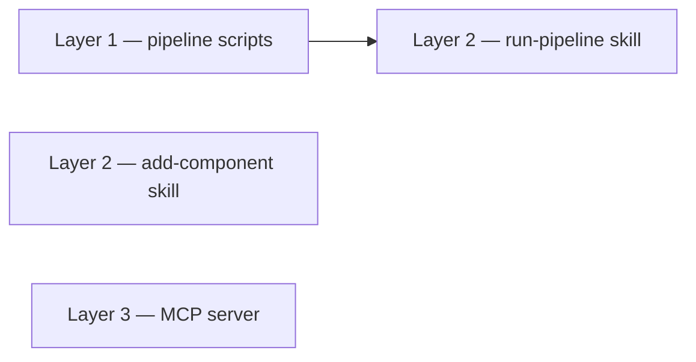

# Horizontal plan — tools-skill-layer

Three architectural layers, cross-layer dependency in one direction only
(Layer 2's pipeline skill depends on Layer 1; nothing else cross-depends).

## Layer 1 — `/pipeline` scripts (foundation)

Turns `pipeline/README.md`'s already-documented command mapping into real,
checked-in, parameterized scripts + a manifest builder. Lives entirely
under `/pipeline/scripts/` + `/pipeline/docker-compose.yml` (or a WebODM
Lightning config) — never imported from `app/`/`components/`/`lib/`, per
this repo's existing `/pipeline` convention. Validated against the real v1/v2
Prado deliverables already on disk as an answer key.

Touches: `pipeline/scripts/*.sh`, `pipeline/scripts/build-manifest.py`,
`pipeline/README.md` (updated once scripts exist), `pipeline/docker-compose.yml`.

## Layer 2 — Claude Code Skills

Two skills, `.claude/skills/<name>/SKILL.md` each (the tool's native
project-skill discovery convention):

- `run-pipeline` — orchestrates Layer 1's scripts end-to-end (raw footage +
  GPS in, property manifest out). Depends on Layer 1.
- `add-component` — copy-and-wire-up (and, folded in, scaffold-new) workflow
  against `components/**` + `docs/components/*.md`. Independent of Layer 1.

Touches: `.claude/skills/run-pipeline/SKILL.md`,
`.claude/skills/add-component/SKILL.md`, and whatever small reference scripts
each skill needs alongside its `SKILL.md`.

## Layer 3 — MCP server

One small standalone package (own `package.json`, `@modelcontextprotocol/sdk`,
stdio transport), reading `docs/components/*.md` at request time — no
duplicated content, no build step. Registered via this repo's `.mcp.json` so
any Claude Code session opened here picks it up automatically. Independent of
Layers 1 and 2.

Touches: `mcp/component-catalog/` (new package), `.mcp.json` (new, repo root).

## Cross-layer dependency graph (layers, not stories — see vertical-plan.md
for the story-level graph)

