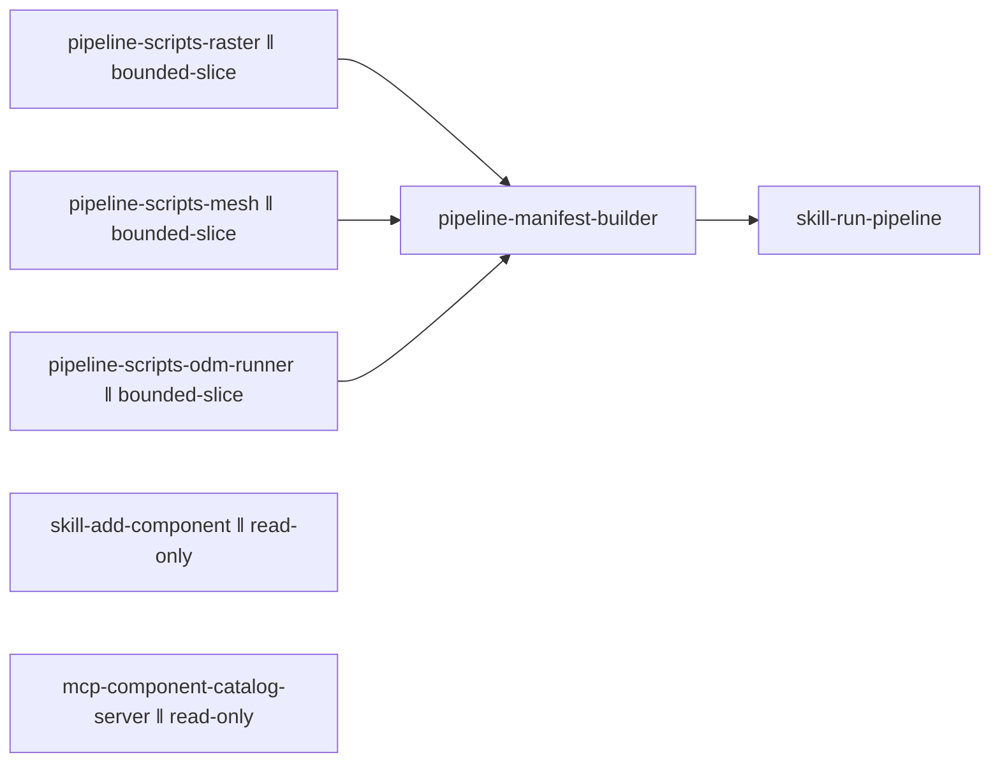

# Vertical plan — tools-skill-layer

Four slices. Each leaves the product in a genuinely working state — slice 1
alone already delivers real value (a runnable pipeline, usable by hand, even
before the skill wrapping it exists).

## Slice 1 — real pipeline scripts (no skill/MCP yet)

Working state after this slice: someone (the operator, by hand, following
`pipeline/README.md`) can run raw drone footage through real, checked-in
scripts and get `layer-viewer-samples`/`model3d-samples`/`minecraft-samples`
manifest assets out — the exact thing that took one-off terminal commands
this session now takes `./pipeline/scripts/run-ortho.sh <project-dir>` etc.

Stories: `pipeline-scripts-raster` (ortho + hillshade + contours),
`pipeline-scripts-mesh` (OBJ→glb conversion + crop + axis-correct + Draco),
`pipeline-scripts-odm-runner` (GPS EXIF extraction + ODM docker invocation,
including the two real operational fixes from this session), `pipeline-manifest-builder`
(assembles the final `LayerDef`/`ModelDef`/`GeoAnchoredModel` JSON from the
other three scripts' output).

## Slice 2 — `run-pipeline` skill (depends on slice 1)

Working state after this slice: the operator runs one Claude Code skill
invocation instead of four manual script calls in the right order.

Story: `skill-run-pipeline`.

## Slice 3 — `add-component` skill (independent, parallel-eligible with
slice 1/2)

Working state after this slice: copying a drone-hub component into an
external app (mdostal.com, tools.mdostal.com, or a future consumer) is one
skill invocation instead of manually hunting down the component file, its
type file, its sample-data convention, and its dependencies.

Story: `skill-add-component`.

## Slice 4 — MCP component-catalog server (independent, parallel-eligible
with slice 1/2/3)

Working state after this slice: any MCP client (this repo's own Claude Code
sessions, at minimum) can query "what components does drone-hub have" and
"how do I use LayerViewer" without opening the repo.

Story: `mcp-component-catalog-server`.

## Story dependency graph

`pipeline-scripts-raster`, `pipeline-scripts-mesh`, and
`pipeline-scripts-odm-runner` are `bounded-slice` parallel-eligible — each
writes a disjoint script file under `pipeline/scripts/`. `skill-add-component`
and `mcp-component-catalog-server` are `read-only` parallel-eligible — both
only read `docs/components/*.md`/`components/**`, writing new content
elsewhere (`.claude/skills/`, `mcp/`) without touching the same files as any
other story.
